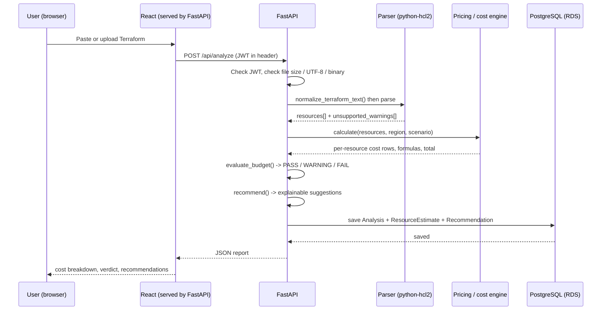
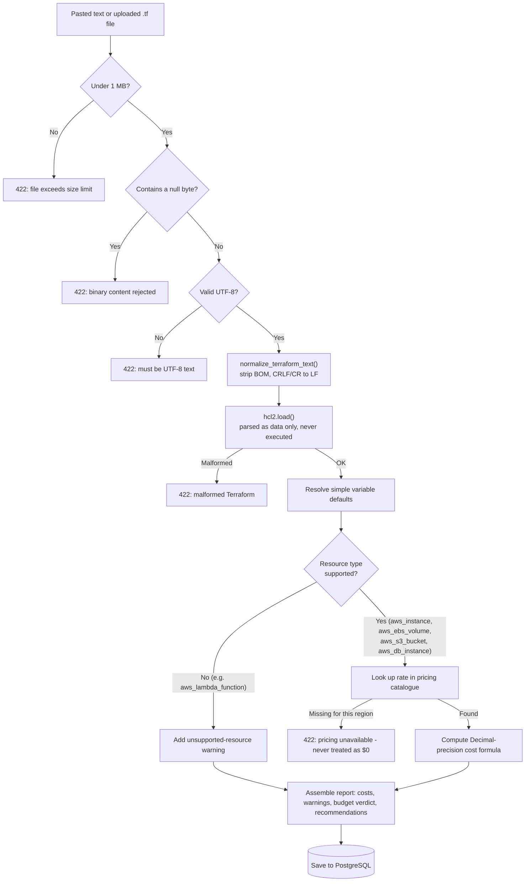
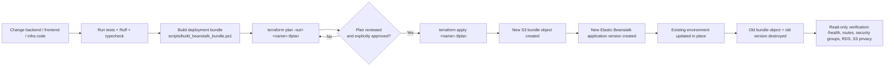

# CloudScope Lite

**Live demo:** http://cloudscope-lite-demo.eba-dvsfqdx3.ap-south-1.elasticbeanstalk.com — plain HTTP, no custom domain (see [Security design](#security-design) and `docs/aws-deployment.md` for why). This is a student-project deployment, not a production service — please don't submit real credentials or sensitive data through it.

CloudScope Lite is a pre-deployment AWS cost simulator. You paste or upload a Terraform configuration; it tells you what that infrastructure would actually cost per month, whether it fits your budget, and where you could save money — **before** you ever run `terraform apply`. It never runs, executes, or deploys the Terraform you give it. It only reads and prices it.

This project was built as a cloud-computing course demonstration: a small full-stack application (React + FastAPI + PostgreSQL) deployed on real AWS infrastructure with Terraform, showing how a team would actually design, secure, and ship a service like this in production — at a scale and cost appropriate for a student budget.

## The problem it solves

Terraform tells you *what* it will create. It doesn't tell you *what that will cost*. Teams routinely discover the price of their infrastructure only after the first bill arrives. CloudScope Lite closes that gap: it parses your `.tf` files, prices every resource it recognizes against real AWS rates, and gives you a clear PASS / WARNING / FAIL verdict against a budget you set — all without touching your AWS account.

## Core features

- **Accounts and projects** — register/login with JWT auth; each project has its own AWS region and a simulated monthly budget.
- **Terraform input** — paste text or upload a `.tf` file (size-limited, UTF-8-validated, binary content rejected, Windows CRLF and BOM normalized automatically).
- **Safe parsing** — uses `python-hcl2` to read the configuration as data. The Terraform is never executed, never passed to the real `terraform` binary, and no `subprocess`/`eval`/`exec` call exists anywhere in the parsing path.
- **Supported resources** — `aws_instance`, `aws_ebs_volume`, `aws_s3_bucket`, `aws_db_instance`. Anything else is flagged as an explicit "unsupported resource" warning — never silently ignored.
- **Transparent cost formulas** — every priced resource shows its exact rate, unit, and formula (e.g. `0.0112 x 730 hours + 20 GB x 0.0912`), not just a final number.
- **Missing prices are errors, never zero** — if a region/resource combination isn't in the pricing catalogue, the analysis reports it explicitly instead of pretending it's free.
- **Workload comparison** — every analysis is priced at low (176 h/month), medium (352 h/month), and high (730 h/month) usage side by side.
- **Budget policy** — PASS (≤80% of budget), WARNING (80–100%), or FAIL (over budget), always with an explanation.
- **Explainable recommendations** — the top cost contributors come with a stated reason, not just a suggestion.
- **History and reports** — every analysis is saved to PostgreSQL; download any of them as JSON or CSV.
- **Forecasting** — upload historical monthly costs as CSV and get a moving-average and a linear-regression forecast, with accuracy metrics once there's enough data.
- **Anomaly detection** — IQR and rolling z-score flags on the same historical data, each with a plain-English explanation.
- **CLI cost gate** — `scripts/cost_check.py` runs the same pricing engine from the command line and returns a non-zero exit code on a budget FAIL, so a CI pipeline can block a deploy on projected cost.

## How it works, end to end



The frontend is a single-page React app that Elastic Beanstalk builds and serves from the **same origin** as the API — the browser never makes a cross-origin request, so there's no CORS to configure in production and no separate hosting/CDN to manage.

## Analysis pipeline: how a submission is validated, parsed, and priced

This is the method the backend follows for every paste or upload, in order — safety checks always run before the text is ever handed to the parser, and a missing price always fails loudly instead of silently becoming zero:



## Architecture

One Docker image, built in two stages and run on one Elastic Beanstalk environment:

1. A Node.js build stage compiles the React app (`npm run build`) with no backend URL baked in — every API call in the code is already a relative `/api/...` path.
2. A Python stage installs FastAPI, copies in the compiled React files, and serves both from the same Uvicorn process. Static assets are served under `/assets`; any other unmatched, non-`/api` path falls back to the React app itself (so client-side routing like `/projects/3` works on a full page load); any unmatched `/api/*` path returns a normal JSON 404.

Elastic Beanstalk manages the underlying EC2 instance and its EBS volume directly — there is no separate, hand-provisioned server.

```mermaid
graph TB
    User(("Browser")) -->|"HTTP :80, same-origin /api/... calls"| EB

    subgraph AWS["AWS Account - ap-south-1"]
        subgraph EnvBox["Elastic Beanstalk Environment"]
            EB["EC2 t3.micro (Docker)<br/>FastAPI + built React app"]
        end

        EB -->|"reads secret by ARN"| SM["Secrets Manager<br/>RDS master password"]
        EB -->|"SQL, private security group only"| RDS[("RDS PostgreSQL<br/>private, Single-AZ")]
        EB -->|"reads deployment bundle"| S3A["S3: artifact bucket<br/>fully private"]
        EB -->|"app + health logs, metrics"| CW["CloudWatch<br/>Logs + environment-health alarm"]
        CW -->|"alarm fires"| SNS["SNS topic"]
        SNS -->|"email"| Owner(("Account owner"))
        EB -.->|"on-demand rate lookup"| PL["AWS Price List API"]
        IAM["IAM roles<br/>least-privilege"] -.->|"scopes access for"| EB
        Budget["AWS Budgets<br/>$5/month email alert"] -.->|"watches real spend on"| AWS
        S3R["S3: reserved bucket<br/>fully private, unused"]
    end

    classDef store fill:#e8f0fe,stroke:#4285f4;
    class RDS,S3A,S3R,SM store;
```

## AWS services used, and why

| Service | Role in this project | Why this one |
|---|---|---|
| **Elastic Beanstalk** | Hosts and runs the application container (both frontend and backend) on its own managed EC2 instance | Handles provisioning, deployment, and health monitoring of the compute layer without needing to hand-manage an EC2 instance, load balancer, or auto-scaling group for a project this size |
| **EC2 + EBS** | The actual virtual machine and disk that Elastic Beanstalk provisions and manages | Not created directly — Elastic Beanstalk owns this so there's one fewer thing to secure and patch by hand |
| **RDS (PostgreSQL)** | Stores users, projects, analyses, resource estimates, recommendations, and uploaded historical cost data | A managed relational database removes the operational burden of running Postgres by hand, and the relational model fits this data (projects → analyses → resource rows) naturally |
| **Secrets Manager** | Holds the RDS master password | RDS generates and rotates this automatically when the database is created with a managed password; the application retrieves it by ARN through its IAM role at startup — the password is never in Terraform state as plaintext, never in an environment variable file, and never in application logs |
| **S3 (private artifact bucket)** | Stores the versioned deployment bundle (backend + frontend source + pricing data) that Elastic Beanstalk deploys from | Elastic Beanstalk deploys application versions from S3; the bucket is fully private — nothing here is ever served to the public |
| **S3 (private reserved bucket)** | Provisioned for possible future project use | Currently holds no application data; kept fully private with no public policy of any kind |
| **IAM** | A dedicated deployment user (used only from a local CLI, never committed) and a scoped instance role that the running application uses | Grants exactly three things to the running app: read the deployment bundle object, read the one RDS secret, and query the public AWS Price List API — nothing else. No wildcard resource access. |
| **VPC / Security Groups** | Default VPC and subnets, with two purpose-built security groups | The application's security group allows inbound HTTP only; the database's security group allows PostgreSQL only from the application's security group, never from the public internet |
| **CloudWatch** | Application logs, and a metric alarm on Elastic Beanstalk environment health | Gives visibility into what the running app is doing and an early warning if the environment degrades |
| **SNS** | Emails the account owner when the CloudWatch alarm fires | The cheapest way to get a human notified without building a paging system |
| **AWS Budgets** | A small monthly budget on the AWS account itself, with an email alert | A safety net against runaway *real* AWS spend — separate from and unrelated to the simulated per-project budget the application itself checks during a cost analysis |
| **AWS Price List API** | Looked up on demand (never continuously running) to build and refresh the local pricing catalogue | This is how the application knows real, current AWS rates instead of guessing or hard-coding stale numbers. It's an API call, not a deployed resource — it never shows up as a running service in the console. |

**Deliberately not used:** CloudFront, S3 static website hosting, a load balancer, NAT Gateway, Lambda, API Gateway, ECS/EKS, and Route 53. All public traffic goes straight to Elastic Beanstalk's own HTTP endpoint on port 80 — the simplest architecture that satisfies the project's actual requirements, at the cost of the connection being HTTP rather than HTTPS (documented in `docs/aws-deployment.md`, along with why CloudFront specifically couldn't be used here).

## Where data lives

| Data | Location |
|---|---|
| Users, projects, analyses, resource estimates, recommendations, historical costs | RDS (PostgreSQL) |
| RDS master password | Secrets Manager (never in Terraform state, outputs, or environment variables) |
| Deployment bundle (backend + frontend source + pricing catalogue) | Private S3 artifact bucket |
| Application + health logs | CloudWatch Logs |
| Pricing rates | A JSON file baked into the deployment bundle, refreshed from the AWS Price List API |

## Running it locally

**With Docker:**
```bash
cp .env.example .env   # then edit the values
docker compose up --build
```
Frontend at `http://localhost:3000`, API at `http://localhost:8000`, interactive docs at `http://localhost:8000/docs`, health check at `http://localhost:8000/health`.

**Without Docker:**
```bash
# backend
cd backend && pip install -r requirements.txt
uvicorn app.main:app --reload

# frontend, in another terminal
cd frontend && npm install && npm run dev
```
`npm run dev` proxies `/api` and `/health` to `http://localhost:8000` automatically (see `frontend/vite.config.mjs`), so the frontend never needs a separate backend URL configured, in development or in production.

## Testing

```bash
# backend
cd backend
python -m pytest -q
python -m ruff check .

# frontend
cd frontend
npx tsc --noEmit
npm run build

# pricing catalogue
python scripts/validate_pricing_catalogue.py

# CI-style cost gate
python scripts/cost_check.py --terraform examples/basic_web_app/main.tf --budget 20 --region us-east-1
```
The CLI's exit codes: `0` on PASS/WARNING, `1` on an enforced budget FAIL, `2` on invalid input or a missing price — designed so a CI pipeline can gate a deploy on projected cost.

## Pricing methodology

Every rate in `pricing/aws_pricing_catalogue.json` is fetched from the official AWS Price List API, tagged with its effective date, currency, unit, and source. Formulas:
- **EC2**: hourly rate x hours + root volume GB x EBS rate
- **EBS / S3**: GB x GB-month rate
- **RDS**: hourly instance rate x hours + allocated storage GB x storage rate

Excluded from every estimate: S3 request/transfer charges, taxes, discounts, free-tier credits, and reserved/spot pricing — this is a straightforward on-demand estimate, not a full billing simulation. A missing price is always reported as an explicit error, never silently treated as zero.

## Policy thresholds and limitations

- Budget policy: **PASS** at or below 80% of budget, **WARNING** from 80–100%, **FAIL** above 100%.
- Forecasts need at least 6 historical data points; accuracy metrics (MAE/RMSE/MAPE) need at least 12.
- Anomaly detection (IQR and rolling z-score) flags statistical outliers — a flag is not evidence of anything by itself, and the app says so.
- Terraform expression support is intentionally limited to simple variable-default substitution. Modules, providers, dynamic blocks, remote state, and full Terraform semantics are out of scope — this is a cost estimator, not a Terraform interpreter.

## Security design

- Passwords are hashed (`pbkdf2_sha256`); JWTs are signed with a secret that is generated by Terraform and stored only as an Elastic Beanstalk environment variable — never in source, logs, or Terraform outputs.
- Every `/api/*` route except `/health` requires a valid JWT; every project/analysis lookup is scoped to the authenticated owner.
- The RDS instance is private (no public IP) and reachable only from the application's own security group, never from the internet.
- Uploaded/pasted Terraform is parsed as data with `python-hcl2` and never executed — there is no code path that shells out, evaluates, or runs the submitted configuration.
- File uploads are capped at 1 MB, must be valid UTF-8, and binary content (detected via a null byte) is rejected outright.

## Deployment

Infrastructure is defined in `infrastructure/` (Terraform). See `docs/aws-deployment.md` for the full deployment guide, `docs/demonstration-guide.md` for a walkthrough script, and `docs/architecture.md` for a short architecture note.

Every deploy follows the same process — a plan is always freshly generated and explicitly approved before anything touches AWS, and the old application version is only ever removed after the new one is confirmed to exist:


